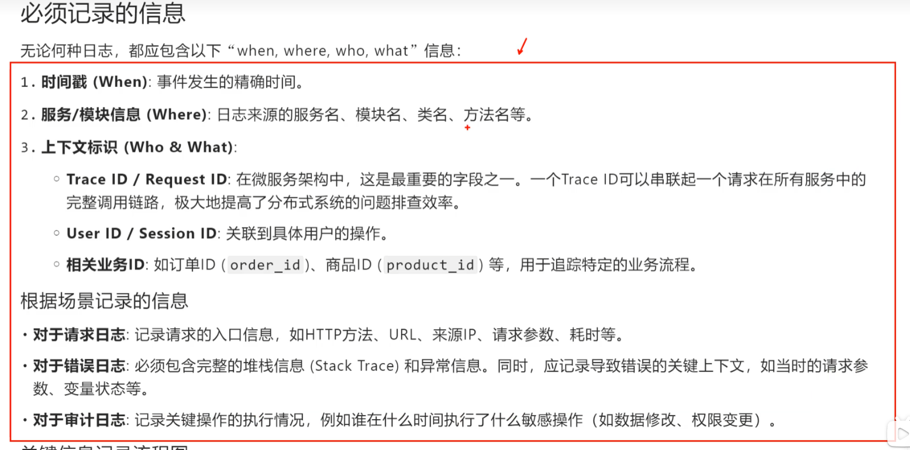

## 日志格式
**结构化vs.非结构化 :** 日志格式的规范性直接影响其可读性和可分析性. 目前,业界主流行趋势是采用==***结构化日志***==.
- **非机构化日**:志纯文本字符串,人类可读,但机器难以解析,分析时需要依赖负载的正则表达式效率低下且容易出错.
- **结构化日志:** 将日志信息以预定义的一致的格式(如json)记录下来.每条日志都是一个键值对集合.即方便人类阅读,也极易被机器解析,查询和分析.
**推荐格式:** josn格式
## 日志级别定义与场景
- **error:** 发生了错误事件,但不影响系统运行,例如:某个api电泳失败,但系统有熔断或降级处理.
- **warn:** 表明可能处在的潜在问题,需要引起注意. 例如:某个依赖服务响应变慢,系统命中率下降.
- info: 在粗粒度级别上突出应用程序的运行过程. 例如:记录关键业务流程的开始和结束,系统启动关闭.
- debug: 用于开发和测试阶段,提供细粒度的调试信息. 例如:记录方法入参,返回值,关键变量的变化.
- trace:比debug更细粒度的信息,用于追踪代码执行的路径. 例如:记录循环的每一次迭代或非常详细的组件内部状态.
## 日志记录的关键信息
-  除了格式和级别外,还必须包含足够且必要的上下文信息,以便于问题的排查和数据分析.
- **必须记录的信息**